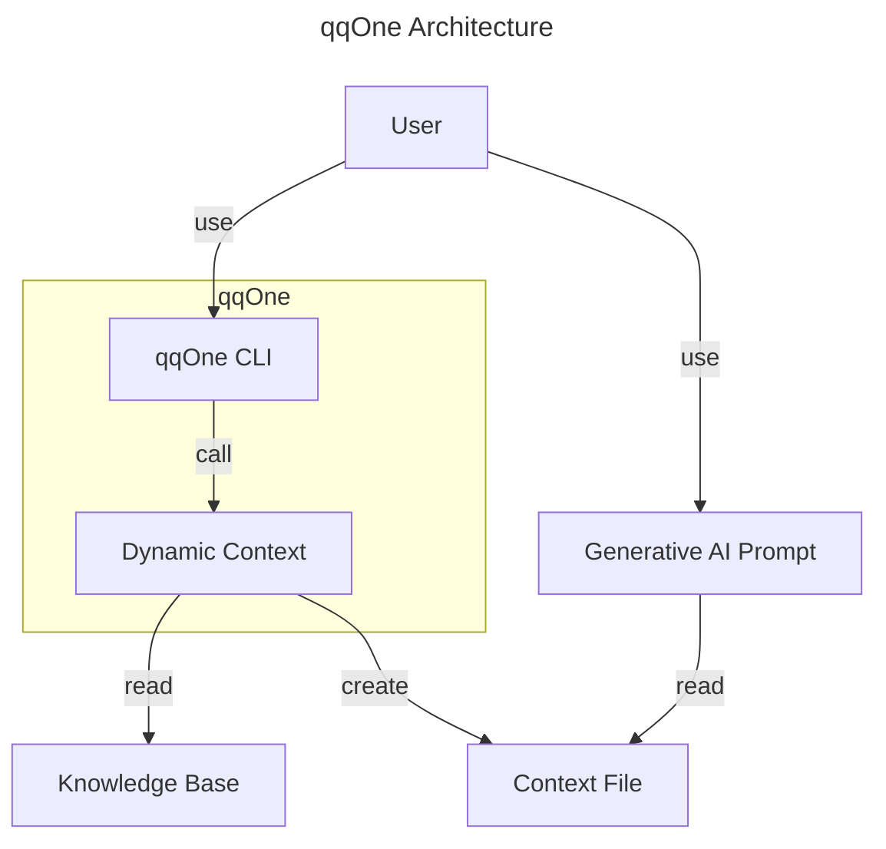

# Project Overview

The qqOne tool allows to maintain a knowledge-base and to query it using a generative AI.

# Architecture

**qqOne**: Provides a command line prompt to interact with the qqOne suite.
**Dynamic Context**: Creates a context file to be sent to the generative AI.