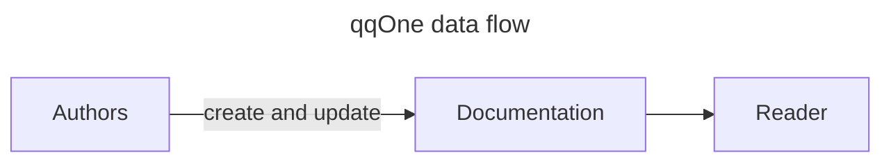
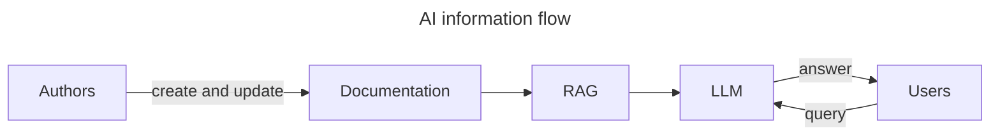
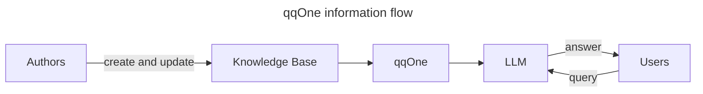
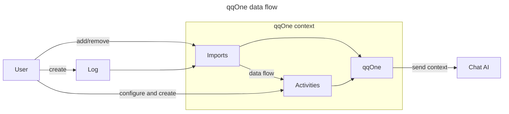

# Why qqOne

<!-- TODO: add a consideration about the paradigm shift: before the human produced the documents, documentation was an end in itself; now the documentation is produced by the hybrid knowledge base. 
    The human's role is to garden the knowledge base. 
    As a consequence, we need a common language to speak with the hybrid knowledge base.

    Example of mathematics, where the language Lean, used to elaborate the demonstrations, now becomes a language used to talk with AI. The demonstrations itself is produced by the AI.
    -->

## Traditional information flow

In the traditional information flow, the Authors create documentation and the Readers consume it. Authors and Readers can be different people, but they can also overlap.

This approach has the disadvantage of the **Fixed Structure**: When Authors write documentation, they choose one fixed way to organise the information, how it’s split into sections, how ideas connect, and the order in which everything should be read. But Readers may approach the content with different questions, follow different mental paths, and may need the information grouped or combined differently. Because the structure is locked in at writing time, it can’t adapt to these varied needs. As a result, complex or unusual questions often don’t fit the document’s layout, and the structure can become an obstacle instead of a help. This is why **Readers are rarely fully satisfied with documentation**, no matter how well it’s written. So documentation ends up in a cycle: Authors reorganise it, Readers still struggle, and the pattern repeats, not because anyone did something wrong, but because **static documentation has inherent limits**.

<!--  Same content, but with more details:

When an Author organizes information into documents, chapters, sections, and hyperlinks, they are making a rigid choice about how the content should be **abstracted**. They are prescribing a linear sequence of concepts and defining how those concepts relate to each other. In cognitive terms, the Author performs the [chunking](https://en.wikipedia.org/wiki/Chunking_(psychology)) — the compression of information into semantically cohesive units — at **writing time**.

The problem is that **at writing time, it is impossible to predict the mental paths that will bring a Reader back to that content**, nor how the Reader will need to abstract it in the future. A document locked into a fixed structure will struggle to answer complex questions. If the Reader's question is sufficiently nuanced — for example, something that spans multiple sections, or that requires combining concepts in an unexpected way — the structure actively gets in the way rather than helping.

Highly structured documents have a low surface entropy: they present an immediately perceivable order and avoid repetition, which makes them appear clean and navigable. But this apparent order comes at a cost. The structure encodes **one** reading path (the Author's), and every other possible reading path is, at best, unsupported and, at worst, obstructed.

The most visible symptom of this rigidity is a familiar one: **the Reader is never truly satisfied with the documentation**. No matter how carefully the Author has organized the material, the Reader will eventually need information sliced along a different axis, combined from different sections, or abstracted at a different level of detail. This is not a failure of the Author — it is a structural impossibility. A single, fixed organization cannot serve the unbounded variety of questions that Readers will bring to it. The result is a perpetual cycle: Readers complain that the documentation is incomplete or hard to navigate; Authors restructure it; and the new structure, while solving some problems, inevitably introduces others. The dissatisfaction is not a bug — it is an inherent property of static documentation.

-->

## AI information flow - enterprise level solution

In the AI information flow, the roles of Author and Reader are augmented by intelligent systems that can understand and adapt to the Reader's needs in real-time. Potentially the Reader may not need to directly interact with the documentation at all.

In our case, Authors and Users can be different people, but they can also overlap.

This approach has the following disadvantages:

1. **Limited Context Understanding:** The solution generally relies on a Retrieval-Augmented Generation (RAG) approach. However, the underlying process of chunking, indexing, and retrieving content can lead to the loss of important context. As a result, the AI may struggle to fully understand the User’s query or its nuances, producing incomplete or irrelevant responses.

2. **Risk of Outdated or Irrelevant Information:** The automated retrieval step may surface obsolete, irrelevant, or mismatched information. For example, if a decision has been updated but the older version remains in Confluence, the AI may still retrieve the outdated content, leading to confusion or incorrect answers.

3. **Implicit Context in Documentation:** Documentation is often written with implicit assumptions, contextual knowledge, and unstated relationships. Because these elements are not explicitly described, the AI may fail to infer them, resulting in gaps in understanding or misinterpretation of the material.

4. **Complex Toolchain Requirements:** Implementing a RAG-based solution requires a complex toolchain that is costly, demands ongoing maintenance, and relies on specialised expertise to operate effectively.

# Why qqOne

**qqOne** aims to address these limitations by removing the key issues found in both approaches. It does this by:
- Using LLMs to let users ask questions in the way that matches their own reasoning.
- **Relying on a smaller but more information‑dense knowledge base**, which improves answer quality and reduces the chance of irrelevant or incorrect responses.
- Requesting the Authors and Users to explicitly maintain the knowledge base.
- **Adopting a much simpler toolchain**, lowering maintenance needs and reducing overall complexity.

## What qqOne does

Authors and Users can be different people, but they can also overlap. Furthermore, but not shown in the diagram, qqOne facilitates the creation and maintenance of the Knowledge Base.

Advantages:

- **Insightful, meaningful and informative answers.** User centric solution. The knowledge base is inherently customised around the User’s needs. This minimizes the risk of superficial, irrelevant or incorrect responses.
- **Realtime updates:** The approach allows a real-time cycle between the use of the chat and the update of the knowledge base, which ensures that the information is incrementally enriched.
- **Minimized costs:** The simplified toolchain and the smaller, more focused knowledge base reduce the costs associated with maintenance and operation.

Potential development for the future: the tool may replace part of the static documentation with a dynamic, user-centric knowledge base.

Limitations:

In the typical LLM+RAG approach, the RAG is totally hidden behind the scenes and the User interact only with the LLM chat. With qqOne, as GitHub Copilot doesn't offer an API to integrate with (to be confirmed), the User must use the qqOne interface and then move to GitHub Copilot to ask the question.  

## Details

